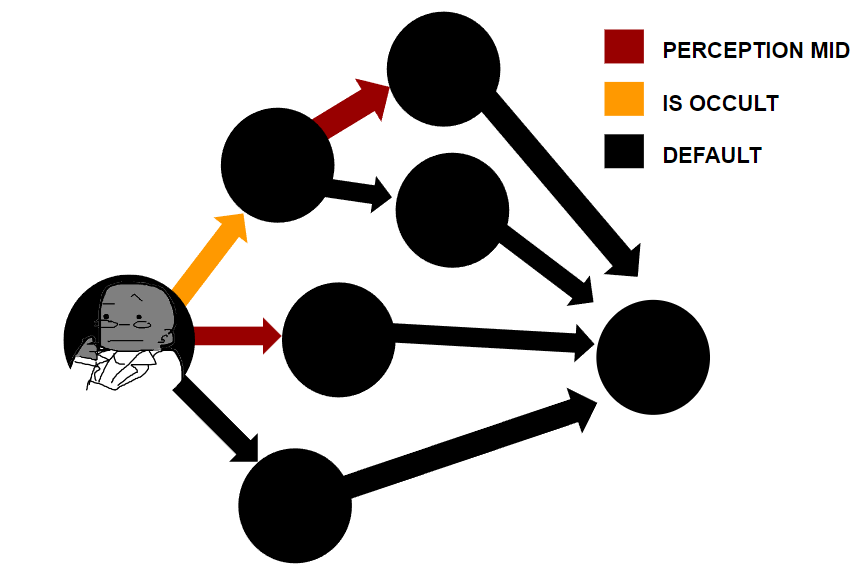

# Rottsmoth Gully
## An attempt at Non-Linear Story-Telling Using Directed Acyclic Graphs

**LINK TO LIVE VERSION** [Play around with what I've got here](https://de-mark.github.io/rottsmoth_gully/)

**QUICK NOTE TO EVERYONE** Has not yet been optimized for non-desktop screens.

**QUICK NOTE TO PROFESSORS** Sorry to change the project from what was initially described in the proposal! Initially, I was intending to display the nodes of the DAG in a graph using JavaScript--which turned out to be a time and a half. Initially, I was thinking of using [D3-DAG](https://erikbrinkman.github.io/d3-dag/) or [Plotly](https://community.plotly.com/t/directed-network-graph-in-javascript/3184), but neither worked too well for displaying a scene.

I was going to switch to using Python and Streamlit, but this had a similar issue, where [Plotly](https://plotly.com/python/network-graphs/) isn't intended to add details to the nodes and [NetworkX](https://networkx.org/documentation/stable/reference/drawing.html) uses static / non-detailed versions. 

Since we had a limited amount of time to throw things together and designing a graph display system which integrated adding, removing, updating etc scenes and connections would take a much longer time with my limited skillset, I switched things around to creating the Non-Linear story with the DAG myself and then allowing the player to navigate it with choices and the like. 

Sorry again for the last minute change! Hopefully it's at least a bit fun to peruse through!

## WHAT IS THIS

This is a Non-Linear story that I've thrown together using a Directed Acyclic Graph (DAG) in which dialog options open up depending on the character's stats, skills, and past options.

The story isn't even close to complete--I just wanted to experiment with using a DAG to accomplish navigating a non-linear story. 

It's all written in vanilla JavaScript within the span of 3 days and I added some 5 second MS Paint doodles to boot. If I get the time later, I'd like to come back and finish this--but as programmers, we all know what those words mean. 

### WHY USE A DAG?

A DAG is a certain category of graph data structure. Graphs are basically data structures that are focused on the relationships of entities. In the case of this project, the DAG is focused on the relationships between scenes of a story.

By their nature, DAGs prevent cycles (you can't get caught doing the same thing over and over again in your story) and require forward momentum (you can't go back to previous story points since this would create the potential for a cycle). Both these properties are perfect for housing a non-linear story: Players should not get endlessly stuck looping from one point back to the past (its not Groundhog's Day starring Bill Murray), and player choices should impact the story (a character with high perception should have different options for moving forward than a character without it).

Also, graphs in general seem to be a good choice for this use case since it's relatively easy to break and add connections / edges AND they're not limited in the number of edges. One scene could have a hundred different ways forward, in theory. It would be horrible story-telling, BUT a graph wouldn't mind.

## USER STORY FOR MVP

As a NON-LINEAR GAME _PROGRAMMER_, I want an easier way to prototype how a player's path through my stories will play out.

Since I'm limited on time, I can't craft a user interface for adding scenes and connections between scenes. BUT, I would like to create a DAG class (including scene nodes and connection edges) that I can hook up to a UI at a later time.

For now, I would like scenes to be treated like DAG nodes/vertices and connections between scenes to be treated like edges. These connections should be either default (available to all characters at this point in the story) or have some sort of requirement associated with them (eg. perception must be greater than 5).

I would also like to have a way to keep track of character classes, stats, and skills so that I can test whether the edges I set up are working properly.

#### CHARACTER: OPTIONS WITH OCCULT BACKGROUND & HIGH PERCEPTION

#### SAME CHARACTER: OPTIONS WITH ONLY HIGH PERCEPTION

#### SAME CHARACTER: OPTIONS WITH NEITHER

## HOW DOES IT WORK?

### CLASSES

**Protagonist** This class keeps track of the player's class, health, and various stats. It's used to assess whether a connection is accessible to a player given their past choices. It's also used to keep track of health, sanity, and other conditions that could result in a game over.

Stats in this case are super simple and include: Physique, Perception, and Willpower. Health is pretty standard. Sanity is included because this will be a Cosmic Horror story about Lovecraftian trash monsters and for those a Sanity stat is required. 

**DAGNode** Essentially, this keeps track of a scene. It has the title, tagline, location, and scene text. It _does not_ keep track of edges / connections. Edges have been decoupled out of the nodes. Since the titles for these can change, DAGNodes use the UUIDv4 method to generate a random arbitrary identifier so that we can keep track of them. 

**DAGEdge** Keeps track of the connection between two scenes. The parent is the scene and the child is the next scene that the player can select. The edgeType defines what condition needs to be met for this option to be available. Option Display is just how the option shows up on the website (eg. "You head West.").

Examples of edgeTypes include:

- _can_use_gun_ Whether the player's class can use a gun
- _low_sanity_ Checks to see whether the player's sanity is 4 or below
- _is_diver_ Looks at whether the player has the "Diving" skill
- _perception_high_ Requires player's perception to be 3 or higher to work

**DAG** This is the actual Directed Acyclic Graph. It keeps track of vertices (scenes) using a list of DAGNodes and of edges (connections between scenes) by using a list of DAGEdges. It also holds the id of the scence / vertex / node the player is currently on.

The DAG does not manage the gameflow per say. Most everything pertaining to game management is just procedural functions in app.js because I'm a horrible spaghetti programmer. However, the DAG keeps track of which scene we're on, returns information about what connections this scene has, and double-checks newly added scenes to ensure (1) duplicate scenes are not added, (2) duplicate connections are not added, and (3) the edges that are added do not create cycles. The DAG does this using an algorithm called [Kahn's Topological Sort](https://en.wikipedia.org/wiki/Topological_sorting).

Before adding a connection between scenes, the DAG creates a hypothetical list of edges and then runs Kahn's Topological Sort on it. If the hypothetical list is not added, then the new scene is not added.

### KAHN'S TOPOLOGICAL SORT

Kahn's topological sort is an algorithm used to traverse a DAG in a linear, sequential order. If Kahn's topological sort does not work, this means there is a cycle in the graph and therefore it is no a DAG.

1) Get degrees for all child nodes.

2) Queue all starting nodes (nodes without a parent).

2) While this queue is not empty, take the first node from the queue. Decrement degrees. 

3) If the node has no edges, we add to the list that we will be returning.

4) Return the list of nodes in linear, sequential order.

If there are items left over (ie. if there is an item in the map that has a degree higher than 0), it means that there is a cycle in the graph and therefore it is not a DAG.

### HOW DOES IT KEEP TRACK OF THE CURRENT SCENE

Easy. The DAG keeps track of the id of your current scene.

It then has a method called `getCurrentScene()` which does exactly what's on the package. It takes the id stored in currentScene and finds the DAGNode object with this id. It then returns this as well as a list of all edges that the current scene is the parent of. 

It also has a function called `setCurrentScene(sceneId)` which takes in a new sceneId (which is stored in the child field of each DAGEdge) and makes it the new currentSceneId. 

The procedural functions in app.js are hooked up so that there's a function called `nextScene` which takes in the id of a scene, uses the DAG to set the current scene to this id, and then calls `displayCurrentScene` which is a function that gets the currentScene from DAG and displayes it on the webpage. 

`displayCurrentScene` is also what manages which connections / edges / options actually show up .

### HOW DOES IT CHECK WHETHER TO DISPLAY A CONNECTION?

If statements.

Look, if you thought I was hiding the next big thing on this, I'm sorry. But the function legit just has a long line of if statements that take the current edge, check the edgeType and compare it with the respective conditions in the character. If the condition matches, the connection will be displayed for the user to see and potentially select. If not, the connection is not added to the page.

So, for example, if you have a perception of 1, and there's an edgeType of `perception_high`, you won't see the connection since it requires a minimum perception of 3. 

## WHY LOVECRAFT TRASH MONSTERS?

Because my default writing anything is Cosmic Horror and I needed to throw something together in less than three days (I spent a long time trying to get the word processor DAG to display and abdanonned the idea pretty late in). Also, I'm borderline obsessed with waste management and trash, so that winds up leaking into everything I create / work on.

## WHY "ROTTSMOTH GULLY" / FIVE SECOND MONOCHROME MS PAINT PORTRAITS?

Bro I had three days okay. (Also, I thought of "Rottswell" too late into the game. DANG IT.)

## IF YOU ONLY HAD THREE DAYS WHY DID YOU MAKE A BILLION UNPLAYABLE CHARACTERS?

Have you MET me?

## WHAT DOES THE ACTUAL DAG LOOK LIKE SO THAT I CAN DOUBLE-CHECK WHETHER YOUR EDGETYPES ARE WORKING AS INTENDED?

Sure!

I want to see if I can add some more characters to this to make sure the Kahn Algorithm was implemented correctly and can handle multiple starting nodes (I THINK it does, but I want to add more complexity to make sure the DAG is robust), but here's what I have right now: 

If I make any edits, I'll make sure to update the map here as well!

#### AGENT GRAPH

